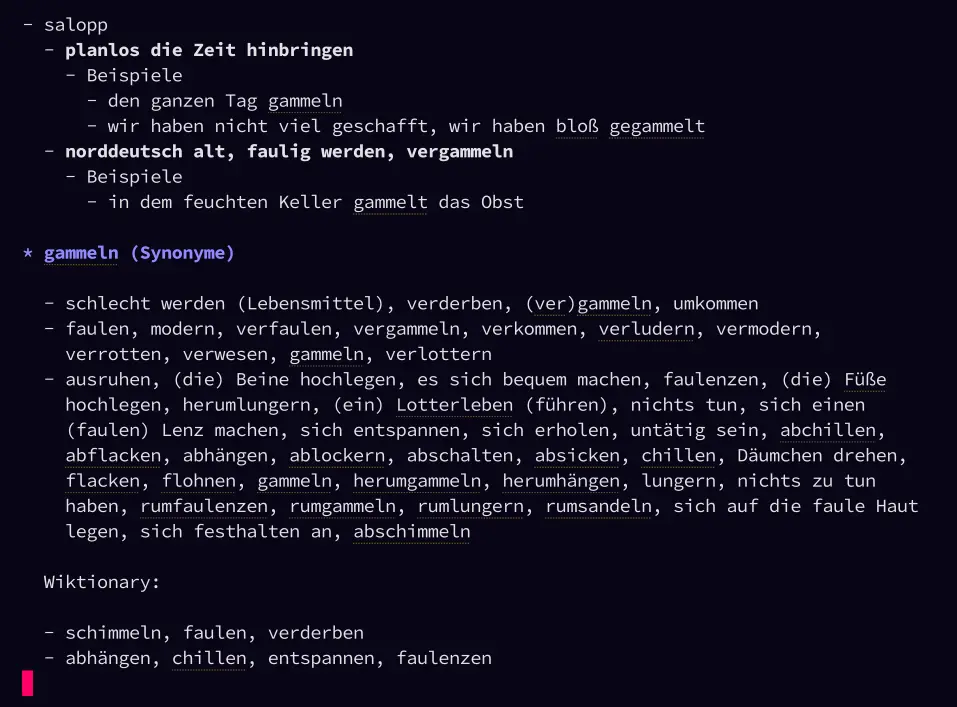

#+STARTUP: showall

* Deprecated

I made a CLI with Rust, using this now instead of Emacs-Lisp code: [[https://github.com/hubisan/rust-woerterbuch][GitHub - hubisan/rust-woerterbuch: Rust CLI for German dictionary data from Duden, DWDS, Wiktionary, and OpenThesaurus]].

Using the following wrappers inside Emacs:

#+BEGIN_SRC emacs-lisp
  (cl-defun woerterbuch
      (&optional query
       &key
       (command "woerterbuch")
       (sources '("openthesaurus" "dwds" "duden" "wiktionary"))
       (sections '("definitions" "examples" "synonyms" "origin" "idioms"))
       (layout "by-source")
       max-examples
       (display-function #'pop-to-buffer))
    "Lookup QUERY with woerterbuch asynchronously and display Org output.

  When called interactively without prefix argument, ask for QUERY.
  When called interactively with prefix argument, use word at point.

  When called from Lisp with QUERY non-nil, use QUERY directly.
  When called from Lisp with QUERY nil, read QUERY according to
  `current-prefix-arg'."
    (interactive)
    (let* ((query
            (or query
                (if current-prefix-arg
                    (let ((word (thing-at-point 'word t)))
                      (unless (and word (not (string-empty-p word)))
                        (user-error "Kein Wort an Punkt gefunden"))
                      word)
                  (read-string "Wort/Redewendung: "))))
           (buffer (generate-new-buffer (format "*woerterbuch: %s*" query)))
           (process
            (apply #'start-process
                   "woerterbuch"
                   buffer
                   command
                   (append
                    (list "--format" "org")
                    (when layout
                      (list "--layout" layout))
                    (when sources
                      (list "--sources" (mapconcat #'identity sources ",")))
                    (when sections
                      (list "--sections" (mapconcat #'identity sections ",")))
                    (when max-examples
                      (list "--max-examples" (number-to-string max-examples)))
                    (list query)))))
      (message "woerterbuch: async lookup started for %S" query)
      (set-process-query-on-exit-flag process nil)
      (set-process-sentinel
       process
       (lambda (proc _event)
         (when (memq (process-status proc) '(exit signal))
           (when-let* ((buf (process-buffer proc)))
             (with-current-buffer buf
               (goto-char (point-min))
               (org-mode))
             (funcall display-function buf)))))))

  (defun woerterbuch-all-by-source ()
    "Lookup all sections by source.
  Without prefix argument, ask for a word or phrase.
  With prefix argument, use word at point."
    (interactive)
    (woerterbuch
     nil
     :sections '("definitions" "examples" "synonyms" "origin" "idioms")
     :layout "by-source"))

  (defun woerterbuch-all-by-section ()
    "Lookup all sections by section.
  Without prefix argument, ask for a word or phrase.
  With prefix argument, use word at point."
    (interactive)
    (woerterbuch
     nil
     :sections '("definitions" "examples" "synonyms" "origin" "idioms")
     :layout "by-section"))

  (defun woerterbuch-synonyms-by-source ()
    "Lookup synonyms by source.
  Without prefix argument, ask for a word or phrase.
  With prefix argument, use word at point."
    (interactive)
    (woerterbuch
     nil
     :sections '("synonyms")
     :layout "by-source"))

  (defun woerterbuch-definitions-by-source ()
    "Lookup definitions including examples by source.
  Without prefix argument, ask for a word or phrase.
  With prefix argument, use word at point."
    (interactive)
    (woerterbuch
     nil
     :sections '("definitions" "examples")
     :layout "by-source"))

  (defun woerterbuch-origin-by-source ()
    "Lookup origin by source.
  Without prefix argument, ask for a word or phrase.
  With prefix argument, use word at point."
    (interactive)
    (woerterbuch
     nil
     :sections '("origin")
     :layout "by-source"))

  (defun woerterbuch-idioms-by-source ()
    "Lookup idioms by source.
  Without prefix argument, ask for a word or phrase.
  With prefix argument, use word at point."
    (interactive)
    (woerterbuch
     nil
     :sections '("idioms")
     :layout "by-source"))
#+END_SRC

* German Woerterbuch for Emacs                                   :Noexport_2:

[[https://www.gnu.org/licenses/gpl-3.0][https://img.shields.io/badge/License-GPL%20v3-blue.svg]] [[https://github.com/hubisan/woerterbuch/actions/workflows/tests.yml][https://github.com/hubisan/woerterbuch/actions/workflows/tests.yml/badge.svg]]

Retrieve definitions (meanings) and synonyms for German words with Emacs.

#+attr_org: :width 300px

** Main features                                                :noexport_0:

Retrieve definitions (meanings) or synonyms for a German word and
- display in an new Org-mode buffer,
- insert into the current Org-mode buffer, or
- add to the kill ring as Org-mode syntax.

The word used for retrieval can be read from the minibuffer or taken from point.

Definitions are retrieved from [[https://www.dwds.de/]] and synonyms from [[https://www.openthesaurus.de/]]. Optionally synonyms from https://de.wiktionary.org can be retrieved as well.

If anyone knows a better way to get definitions or synonyms than parsing DWDS and Wiktionary, please open an issue. [[https://github.com/hdaSprachtechnologie/odenet][Open German WordNet]] looks promising but needs time to mature.

-----

** Contents

- [[#installation][Installation]]
- [[#usage][Usage]]
- [[#customization][Customization]]
- [[#key-bindings][Key Bindings]]
- [[#changelog][Changelog]]
- [[#contributing][Contributing]]

** Installation
:PROPERTIES:
:CUSTOM_ID: installation
:END:

# Describe how to install this package.

This package is hosted on Github. Use your favourite way to install like [[https://github.com/progfolio/elpaca][Elpaca]], [[https://github.com/radian-software/straight.el][Straight]], [[https://github.com/quelpa/quelpa][Quelpa]]. Starting with Emacs 29 ~package-vc-install~ may be used.

** Usage
:PROPERTIES:
:CUSTOM_ID: usage
:END:

If a word is not in its base form, the base form is determined and definitions or synonyms for that base form are retrieved. For example, the base form of "Fahrzeuge" is "Fahrzeug".

*** Show Definitions

- woerterbuch-definitions-show-in-org-buffer :: Show the definitions for a word in an Org buffer. Reads the word from the minibuffer.
- woerterbuch-definitions-show-in-org-buffer-for-word-at-point :: Show the definitions for a word at point in an Org buffer.
- woerterbuch-definitions-insert-into-org-buffer :: Read a word from the minibuffer and insert the definitions as a list into the current Org buffer. If called with a prefix arg (C-u), it adds a heading with the word as the title before the list.
- woerterbuch-definitions-kill-as-org-mode-syntax :: Add the definitions for word read from the minibuffer to the kill ring as Org syntax. If called with a prefix arg (C-u), it adds a heading with the word as title before the list.

Example output for word "Wörterbuch":

#+BEGIN_SRC org
  ,* Wörterbuch (Bedeutungen)

  - *(gedruckt, auf einem elektronischen Medium oder im Internet publiziertes) Nachschlagewerk mit nach bestimmten Gesichtspunkten ausgewählten und erläuterten Stichwörtern, meist mit Informationen zu ihrer Form, ihrer Bedeutung und ihrem Gebrauch*
    - Beispiele
      - […] Dort [in Südanatolien] […] lernte [sie] mithilfe eines Wörterbuchs Türkisch.
#+END_SRC

*** Show Synonyms

- woerterbuch-synonyms-show-in-org-buffer :: Show the synonyms for a word in an Org buffer. Reads the word from the minibuffer.
- woerterbuch-synonyms-show-in-org-buffer-for-word-at-point :: Show the synonyms for a word at point in an Org buffer.
- woerterbuch-synonyms-insert-into-org-buffer :: Read a word from the minibuffer and insert the synonyms as a list into the current Org buffer. If called with a prefix arg (C-u), it adds a heading with the word as the title before the list.
- woerterbuch-synonyms-kill-as-org-mode-syntax :: Add the synonyms for word read from the minibuffer to the kill ring as Org syntax. If called with a prefix arg (C-u), it adds a heading with the word as title before the list.
- woerterbuch-synonyms-insert :: Lookup synonyms for word read from minibuffer and insert selected word at point. If called with a prefix arg (C-u) the selected word is added to the kill ring instead.
- woerterbuch-synonyms-lookup-word-at-point :: Lookup synonyms for word at point and add to kill ring. 
- woerterbuch-synonyms-replace-word-at-point :: Lookup synonyms for wort at point or selection and replace it. This is only of use if the word at point is in its baseform.

Example output for the word "Wörterbuch", with synonyms from Wiktionary enabled:

 #+BEGIN_SRC org
   ,* Wörterbuch (Synonyme)

   - Wörterbuch, Lexikon, Vokabular, Vokabularium, Wörterverzeichnis, Diktionär

   Wiktionary:

   - manchmal (veraltend) auch: Diktionär, Dictionnaire, Enzyklopädie, Lexikon, Thesaurus
 #+END_SRC

*** Show Definitions & Synonyms 

- woerterbuch-definitions-and-synonyms-show-in-org-buffer :: Show both the definitions and synonyms for a word in an Org buffer. Reads the word from the minibuffer.
- woerterbuch-definitions-and-synonyms-show-in-org-buffer-for-word-at-point :: Show both the definitions and synonyms for the word at point in an Org buffer.
- woerterbuch-definitions-and-synonyms-insert-into-org-buffer :: Read a word from the minibuffer and insert both definitions and synonyms into the current Org buffer.

** Customization
:PROPERTIES:
:CUSTOM_ID: customization
:END:

*** Variables

Set the following variables to change the behavior of the package:

- woerterbuch-org-buffer-display-function :: ~#'pop-to-buffer~ Function used to the display the org buffer with the definitions or synonyms. The function takes buffer as argument. There is also a function provided to show it in a dedicated side window: 
  #+BEGIN_SRC emacs-lisp
    ;; Set the variable:
    (setq woerterbuch-org-buffer-display-function
          (apply-partially #'woerterbuch-display-in-side-window 'right 80))
  #+END_SRC
- woerterbuch-list-bullet-point :: ~"-"~ String to use as list bullet point when converting synonyms or definitions to a list.
- woerterbuch-insert-org-heading-format :: ~"%s %s\n\n%s"~ Format used when inserting an Org heading before content.
- woerterbuch-definitions-heading-text-format :: ~"[[https://www.dwds.de/wb/%1$s][%1$s]] - Bedeutungen"~ Format used for the heading text when inserting an Org heading before content.
- woerterbuch-definitions-no-matches-text-format :: ~"Keine Bedeutungen für [[https://www.dwds.de/wb/%1$s][%1$s]] gefunden.\n"~ Format used for the text when no definitions are found.
- woerterbuch-definitions-examples-add :: ~nil~ If non-nil examples for definitions are added.
- woerterbuch-definitions-examples-max :: ~2~ The maximum number of examples to add for each definition.
- woerterbuch-synonyms-heading-text-format :: ~"[[https://www.openthesaurus.de/synonyme/%1$s][%1$s]] - Synonyme"~ Format used for the heading text when inserting an Org heading before content.
- woerterbuch-synonyms-no-matches-text-format :: ~"Keine Synonyme für [[https://www.openthesaurus.de/synonyme/%1$s][%1$s]] gefunden.\n"~ Format used for the text when no synonyms are found.
- woerterbuch-synonyms-add-synonyms-from-wiktionary :: ~nil~ If non-nil synoyms taken from Wiktionary are added.
- woerterbuch-synonyms-wiktionary-format :: ~"\nWiktionary:\n\n%3$s"~ Format used for the synonyms added from wiktionary.
- woerterbuch-quit-window-key-binding :: ~C-c C-k~ Key binding to use for `quit-window' in the woerterbuch buffer. If set to nil no key binding is set.

** Key Bindings
:PROPERTIES:
:CUSTOM_ID: key-bindings
:END:

- @@html:<kbd>@@C-c C-q@@html:</kbd>@@ is bound to ~quit-window~ in the Org buffer showing the definitions or synonyms, unless you change the default value of the variable ~woerterbuch-quit-window-key-binding~.

** Changelog
:PROPERTIES:
:CUSTOM_ID: changelog
:END:

See the [[./CHANGELOG.org][changelog]].

** Contributing
:PROPERTIES:
:CUSTOM_ID: contributing
:END:

Use the issue tracker to reports bugs, suggest improvements or propose new features. If you want to contribute please open a pull request after having opened a new issue.

In any case please check out the [[./CONTRIBUTING.org::*Contributing][contributing guidelines]] beforehand.

** Remarks

*** Synonyms

**** Openthesaurus

The text returned can contain additional information in parentheses.

Examples:

#+BEGIN_EXAMPLE
- aufsetzen (Schreiben, Kaufvertrag, ...)
- errichten (Testament, Patientenverfügung, ...)
- (die) Probe aufs Exempel
#+END_EXAMPLE

This information is removed, when reading from the minibuffer. Else it is not removed and inserted into the buffer.

**** Wiktionary

It appears that when composing synonyms on Wiktionary, users have the a lot of freedom to formulate the text. Therefore, I avoid parsing the synonyms into a list which is used when reading from the minibuffer. Similar to Openthesaurus, the synonyms are inserted into an Org buffer exactly as they are formulated.

Examples of texts used (word 'geben'):

#+BEGIN_EXAMPLE
- abtreten, reichen, übertragen, vermachen
- aushändigen, hinreichen, in die Hand drücken, übergeben, überlassen, überreichen
  gehoben: darbieten, darreichen, zukommen/zuteilwerden lassen
  oft gehoben: reichen
  bildungssprachlich: präsentieren
  umgangssprachlich: langen, rüberwachsen lassen
  Papierdeutsch: verabreichen; Papierdeutsch veraltend: verabfolgen
- schenken, gewähren, zum Geschenk machen, zustecken
  schweizerisch: vergaben
  gehoben: bedenken, beglücken, stiften, zukommen/zuteilwerden lassen
  umgangssprachlich: spendieren
  gehoben oder ironisch angedeihen lassen
  leicht scherzhaft: verehren
  veraltet: zueignen
#+END_EXAMPLE
